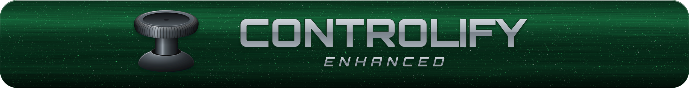
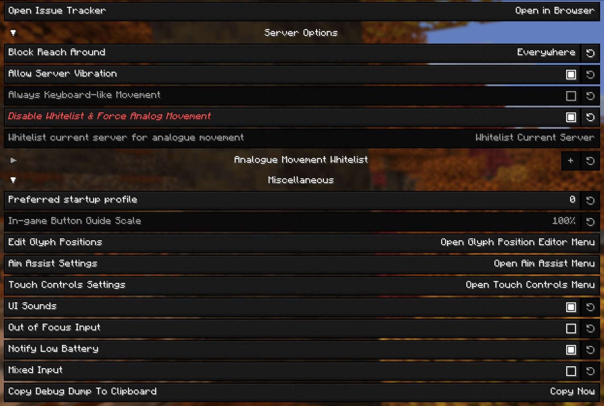
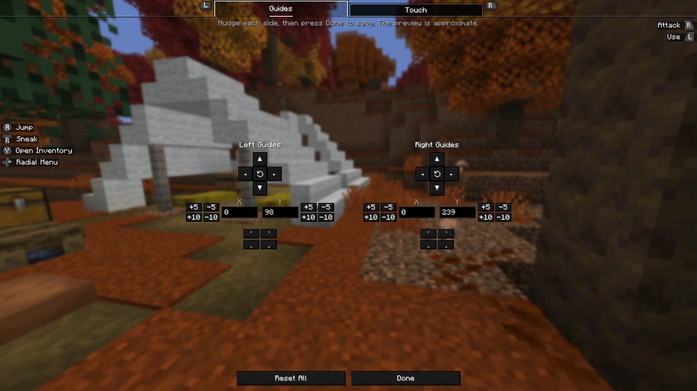
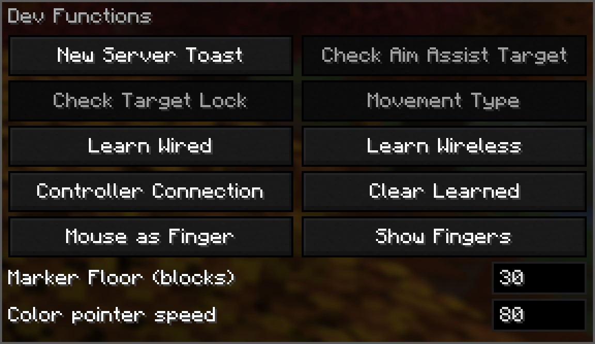

<div align="center">



**An unofficial custom build of [Controlify](https://github.com/isXander/Controlify), the controller support mod for Minecraft: Java Edition.**

[](https://patreon.com/isxander)

</div>

---

## What's different in this fork

Controller aim assist with target lock, a couple of quality-of-life options, and fixes for three annoyances — all on Controlify's **Global Settings** screen. Everything else behaves exactly like the official mod.

**New options**

- [Aim assist](#aim-assist) — for melee and bows, with [target lock](#target-lock), a [compass bar](#compass-bar), [marker and compass colours](#marker-and-compass-colours) and a [custom target list](#custom-target-list). Off by default.
- [Edit Glyph Positions](#edit-glyph-positions) — move the in-game button guides out of the way.
- [Disable Whitelist & Force Analog Movement](#disable-whitelist--force-analog-movement) — analog movement on every server.

**Fixes**

- ["New server detected" toast](#new-server-detected-toast) — only shown when it applies.
- [One controller counted twice](#one-controller-counted-twice) — a pad Windows reports twice is held once.

**Testing**

- [Dev Functions panel](#dev-functions-panel) — trigger things on demand.

<p align="center">
  
  <br>
  <em>The Global Settings screen in this build.</em>
</p>

---

## New options

### Aim assist

With aim assist on, the look stick slows as your crosshair comes onto a mob and pulls gently towards it, so you stop overshooting. It only scales the look input you're already giving — it never moves the camera on its own, never widens a hitbox, and never changes where an attack lands.

**Aim Assist** — off, **Singleplayer & LAN**, or **Everywhere**.

> [!WARNING]
> Many servers treat any aim assist as an unfair advantage. Only use **Everywhere** on servers you know allow it. **Singleplayer & LAN** is the default and never touches a multiplayer server.

**Target** — hostile mobs (provoked ones included, like an angry wolf pack), all mobs, or a custom list. Players are never targeted.

**Melee** and **Bow** are tuned separately, each with **Strength** (how hard it slows and pulls), **Crosshair Cone** (how far off a mob can be, in degrees) and **Distance** (in blocks). Bow takes over while you draw a bow or hold a loaded crossbow, and is gentler — it never leads a shot or allows for arrow drop.

<p align="center">
  
  <br>
  <em>Melee and bow are tuned independently.</em>
</p>

#### Target lock

Holds one mob as your target instead of whichever is nearest the crosshair. Bind **Lock Target** under Gameplay in Controller Bindings: tap to lock the nearest mob or move to the next, hold to let go. It follows the **Aim Assist** setting, so it never runs anywhere aim assist isn't allowed.

<p align="center">
  
  <br>
  <em>The marker sits over the head of whatever is locked.</em>
</p>

**Mode** decides what locks a target:

- **Keybind lock** — only the bind.
- **Last hit lock** — the bind, plus whatever you hit and whatever hits you. A mob that shoots you only takes the lock when there's nothing else worth locking.
- **Marker only** — the marker and compass, with no aim help at all.

While a target is locked, **Locked Strength**, **Locked Range** and **Locked Speed** stand in for the melee and bow settings. **Show Target Marker** draws the marker — solid with line of sight, faded without — and keeps it readable at range.

**Ignore Crosshair Cone** pulls towards the locked mob from any angle, even when you're both standing still.

> [!WARNING]
> This tracks a mob for you rather than helping aim you're already making. That's an unfair advantage over players without Controlify, and many anti-cheats will likely flag it. Use it in singleplayer, or where everyone knows you have it and is fine with it.

**Letting Go** — with **Drop Distant Targets** off, a lock only ends when the mob dies or you clear it. Turn it on and the lock drops once you've been further than **Range** (or **Flying Range**) from the mob for longer than **Time Before Dropping**. **Reset Depth** is how far back inside you have to come to reset the timer.

<p align="center">
  
  <br>
  <em>The Target Lock section. Everything under Letting Go stays greyed out until Drop Distant Targets is on.</em>
</p>

#### Compass bar

**Show Compass Bar** puts a strip along the top of the screen showing which way the locked mob is, with its name, its distance, and the countdown before a distant lock is dropped. **Compass Position** opens a live editor: drag it, type exact offsets, snap it to a corner, set its width, or reset it.

<p align="center">
  
  <br>
  <em>The slime is off to the left; the marker on the bar is where to turn.</em>
</p>

#### Marker and compass colours

**Marker & Compass Colors** gives each its own colour wheel, with brightness beside it, the hex value underneath, and a reset. On a controller, press A on a wheel and steer with the left stick — slower than the virtual mouse, so you can land on the shade you want.

<p align="center">
  
</p>

#### Custom target list

Set **Target** to **Custom list** and **Open Target List** lets you pick from every entity in the game, modded ones included. Search by name or browse by tab, and add or remove all the hostile or provocable mobs in one press. In a world, every row shows the actual mob.

<p align="center">
  
</p>

### Edit Glyph Positions

Move the left and right in-game button guides separately — nudge them, type exact offsets, snap to a corner, or reset. Handy for keeping them clear of other HUD elements, like beacon effect icons. Requires a connected controller.

<p align="center">
  
  <br>
  
  <br>
  <em>The editor, and both guide columns moved clear of the map and the beacon powers.</em>
</p>

### Disable Whitelist & Force Analog Movement

Analog movement — walking speed follows how far you tilt the stick — on **every** server, not just those in the Analogue Movement Whitelist. While it's on, the whitelist is ignored and the "New server detected" toast never appears.

> [!WARNING]
> Some server anti-cheats may flag or ban you for analog movement. Only turn this on if you're sure every server you play on allows it.

---

## Fixes

### "New server detected" toast

The official mod shows this toast on Realms even though analog movement already works there, and whitelisting a Realm doesn't help because its address changes every time it reopens. This build only shows the toast when keyboard-like movement is actually in use, so it no longer appears on Realms or whitelisted servers.

<p align="center">
  
</p>

### One controller counted twice

On Windows, one pad can be reported twice — through XInput and through GameInput — so it arrived as two controllers, with two toasts, swapping on every replug. This build keeps one. It's an upstream bug that also happens on the official 3.5.3, and launching with `-Dcontrolify.sdl.dedupe=0` turns the fix off.

---

## Testing

### Dev Functions panel

A panel in Global Settings for triggering things on demand while testing: **New Server Toast**, **Check Aim Assist Target**, **Check Target Lock**, **Movement Type** and **Controller Connection**, plus **Marker Floor (blocks)** and **Color pointer speed** to type values into. The checkbox below it hides it.

<p align="center">
  
</p>

**Controller Connection** reports whether the pad is on a cable or a receiver — something the game can't work out by itself, so you teach it once: press **Learn Wired** on a cable and **Learn Wireless** on a receiver. For a few seconds after plugging in or unplugging, both buttons grey out and read **Wait...** until the connection settles. **Clear Learned** starts over.

---

## Install

1. Download the latest `-universal.jar` from [Releases](https://github.com/dx-Arcus/Controlify-Enhanced/releases/latest). One jar covers both Fabric and NeoForge.
2. Remove the official Controlify from your `mods` folder — running both at once will not work.
3. Drop this jar in alongside [YetAnotherConfigLib](https://modrinth.com/mod/yacl).

Built for Minecraft **26.3**, with Fabric Loader 0.19 or newer, or NeoForge.

## Building it yourself

```sh
git clone https://github.com/dx-Arcus/Controlify-Enhanced.git
cd Controlify-Enhanced
./gradlew ":26.3:build"
```

The jars land in `versions/26.3/build/libs/`. JDK 25 is required.

## Issues

Problems with **this build** belong in [this repository's issue tracker](https://github.com/dx-Arcus/Controlify-Enhanced/issues), which is where the in-game Issue Tracker button and the Mod Menu links point. Please don't report them to isXander.

Problems you can also reproduce on the official mod belong in [Controlify's issue tracker](https://github.com/isXander/Controlify/issues).

## Credits

Controlify is made by [isXander](https://github.com/isXander) and its contributors, and is licensed under [LGPL-3.0](LICENSE), as is this fork. The [Controlify Wiki](https://controlify.isxander.dev) covers how to use and configure the mod; everything there applies to this build too.

If you get use out of Controlify, [support isXander on Patreon](https://patreon.com/isxander).
