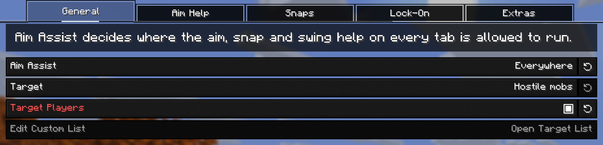
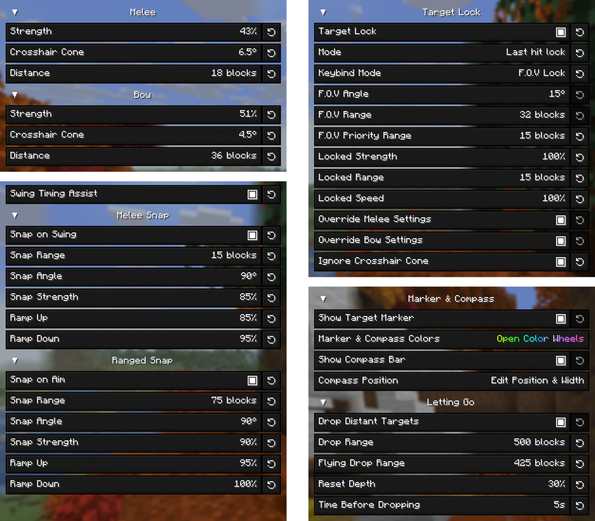
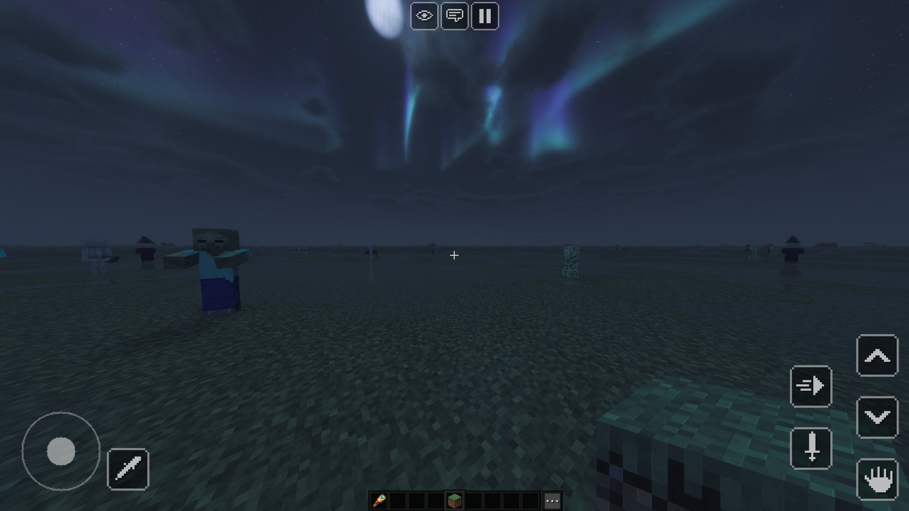
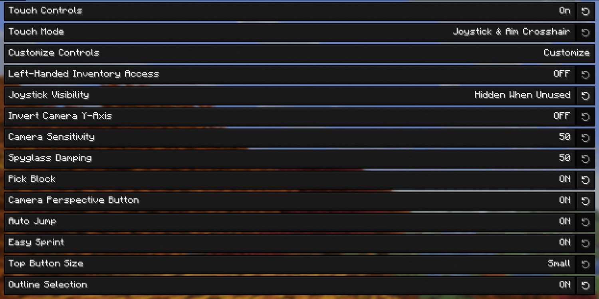
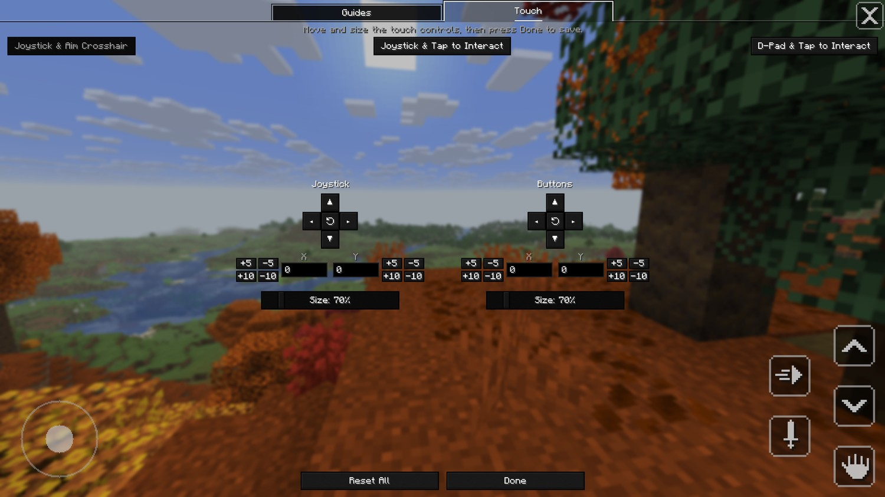
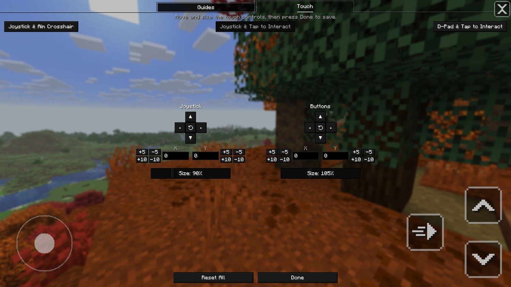
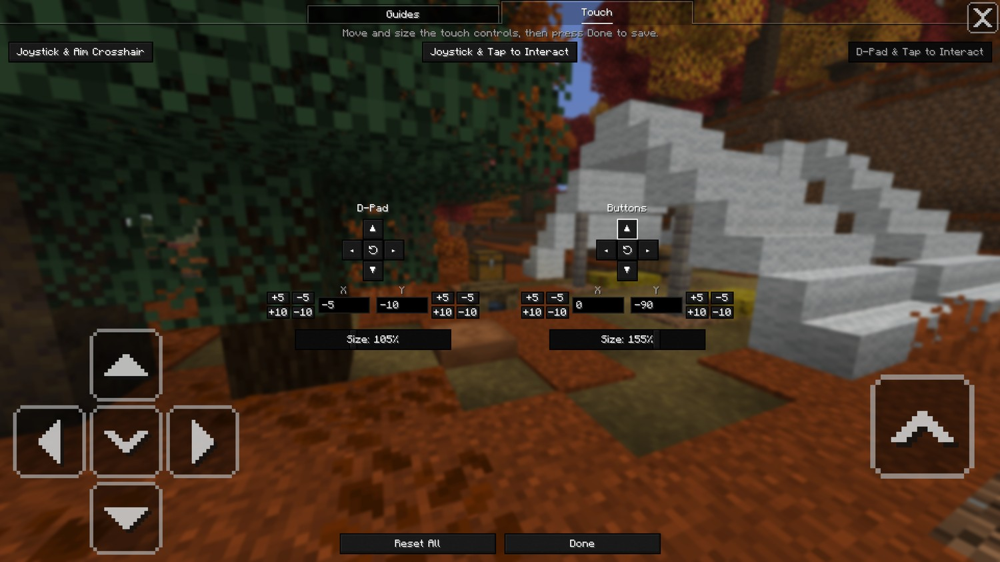

<div align="center">


**An unofficial custom build of [Controlify](https://github.com/isXander/Controlify), the controller support mod for Minecraft: Java Edition.**

[](https://patreon.com/isxander)

</div>

---

## What's different in this fork

Touch controls modelled on Bedrock Edition's, controller aim assist with target lock, a few quality-of-life changes, and fixes for two annoyances — most of it on Controlify's **Global Settings** screen. Everything else behaves exactly like the official mod.

**New options**

- [Aim assist](#aim-assist) — for melee and bows, with [Trajectory Aim](#trajectory-aim), [target lock](#target-lock), [snaps and Swing Timing Assist](#snaps-and-swing-timing-assist), a [compass bar](#compass-bar), [marker and compass colours](#marker-and-compass-colours) and a [custom target list](#custom-target-list). Off by default.
- [Touch controls](#touch-controls) — play on a touchscreen in [all three of Bedrock's modes](#touch-modes), each with a [layout of your own](#customize-controls). They switch themselves on at a touch.
- [Edit Glyph Positions](#edit-glyph-positions) — move the in-game button guides out of the way.
- [Disable Whitelist & Force Analog Movement](#disable-whitelist--force-analog-movement) — analog movement on every server.
- [Quick move to the off hand](#quick-move-to-the-off-hand) — Y on a totem, rocket, torch and the like puts it in your off hand.
- [Anti-cheat reminder](#anti-cheat-reminder) — a red line on the multiplayer screen while a setting servers punish is on.

**Fixes**

- ["New server detected" toast](#new-server-detected-toast) — only shown when it applies.
- [One controller counted twice](#one-controller-counted-twice) — a pad Windows reports twice is held once.
- [On-screen keyboard on 26.3](#on-screen-keyboard-on-263) — what you type, and backspace, reach the text box again.

**Testing**

- [Dev Functions panel](#dev-functions-panel) — trigger things on demand.

<p align="center">
  
  <br>
  <em>The Global Settings screen in this build.</em>
</p>

---

## New options

### Aim assist

With aim assist on, the look stick slows as your crosshair comes onto a mob and pulls gently towards it, so you stop overshooting. It only scales the look input you're already giving — it never moves the camera on its own, never widens a hitbox, and never changes where an attack lands. [Trajectory Aim](#trajectory-aim) and the [snaps and Swing Timing Assist](#snaps-and-swing-timing-assist) go further, and stay off until you switch them on.

**Open Aim Assist Menu** in Global Settings opens its screen: five tabs — **General**, **Aim Help**, **Snaps**, **Lock-On** and **Extras** — with LB and RB to move between them. Each tab opens with a line on how its settings work with the rest.

<p align="center">
  
  <br>
  <em>The General tab.</em>
</p>

**Aim Assist** — off, **Singleplayer & LAN**, or **Everywhere**.

> [!WARNING]
> Many servers treat any aim assist as an unfair advantage. Only use **Everywhere** on servers you know allow it. **Singleplayer & LAN** is the default: your own worlds, opened to LAN or not, and LAN worlds you join from the multiplayer screen's list of LAN games. A world you join by its address counts as a server.

**Target** — hostile mobs (provoked ones included, like an angry wolf pack), all mobs, or a custom list. Players are left out unless **Target Players** is on, which lets them count whatever Target is set to, for every part of aim assist. Teammates the game won't let you hurt stay out either way.

> [!WARNING]
> Aim help against other players is treated as cheating by almost every server and anti-cheat. **Target Players** is off by default, and even when it's on, players only count where the **Aim Assist** setting allows.

**Melee** and **Bow**, on the **Aim Help** tab, are tuned separately, each with **Strength** (how hard it slows and pulls), **Crosshair Cone** (how far off a mob can be, in degrees) and **Distance** (in blocks — up to 64 for melee, 500 for the bow). Bow takes over while you draw a bow or hold a loaded crossbow, and is gentler. On its own it never leads a shot or allows for arrow drop; [Trajectory Aim](#trajectory-aim), just under its sliders, does both.

<p align="center">
  
  <br>
  <em>The other four tabs, narrowed to fit side by side: Aim Help and Snaps on the left, Lock-On and Extras on the right.</em>
</p>

#### Trajectory Aim

**Trajectory Aim**, under the bow's sliders on the **Aim Help** tab, aims the shot for you. Instead of helping the crosshair onto the mob, it takes the crosshair to where an arrow or bolt has to go to land on the mob — above it for the drop over the distance, ahead of it if it's moving, and allowing for your own movement — and holds it there as the mob, you and the draw move it. It follows how the game really flies a shot, so a rocket from a crossbow, which flies straight, gets a straight aim.

- **Off** — bow aim assist helps you onto the mob itself, as before. The default.
- **Full Draw** — aims for a fully drawn bow the whole time, so the crosshair holds still while you draw. Let go early and the arrow falls short.
- **Live** — aims for the bow as drawn right now, so an arrow let go at any moment lands. A weak early draw has to be lobbed high to reach a mob at all, so until that point comes within **Live Start Angle** of the full-draw point it aims for a full draw; then the crosshair makes that last move. The angle is yours to set, 5° to 45°; lower keeps the crosshair steadier, and at 45° it goes to the live point as soon as a shot can reach the mob. A loaded crossbow always shoots at one speed, so it gets the same help either way.

**Lock-On Only**, on by default, has it aim only for the mob you've locked with [target lock](#target-lock); any other mob gets the bow's ordinary help onto the mob itself. Switch it off and it also takes a mob the crosshair cone finds, once you've settled the crosshair on it for a moment with the look stick eased off, so panning past mobs with the bow drawn takes none of them; then it keeps that mob for the whole draw, wherever you take the crosshair, while the mob stays within **Distance** and in sight. To let it go, push the look stick hard away from it for a moment.

**Lag Compensation** allows for what you see of a mob being behind where the server has it — your ping, plus the game's own delay in showing a mob's movement, about 175 ms even in singleplayer — which otherwise lands a shot behind a moving mob by that much. **Manual** allows for the **Lag Allowance** you set, in milliseconds; your ping plus about 175 ms is the place to start. **Auto** reads your ping from the server, the number the tab list shows, and adds the 175 ms itself. All of these rows stay greyed out until Trajectory Aim is on.

Every shot still has the little random spread the game gives it, which nothing can allow for.

> [!WARNING]
> Trajectory Aim turns the camera for you, which many servers and anti-cheats treat as cheating. It only runs where the **Aim Assist** setting allows, and not at all while Target Lock is set to **Marker only**.

#### Snaps and Swing Timing Assist

These go further than aim assist: they turn the camera or swing for you. All three are on the **Snaps** tab, each is off until you switch it on, and like the rest they only run where the **Aim Assist** setting allows.

- **Melee Snap** (**Snap on Swing**) turns the camera onto a mob when you swing at nothing — your locked target if it's within **Snap Range**, otherwise the hostile mob nearest your crosshair within **Snap Angle** and **Snap Range**. A swing at a block or a mob is never pulled away.
- **Ranged Snap** (**Snap on Aim**) does the same as you start drawing a bow or bring up a loaded crossbow — and with [Trajectory Aim](#trajectory-aim) on, it turns to where the shot has to go rather than onto the mob.
- Each snap has its own **Snap Range**, **Snap Angle**, **Snap Strength** (how fast it turns — 600 degrees a second at 100%), **Ramp Up** and **Ramp Down** (how quickly it gets up to speed, and how quickly it slows to land).
- **Swing Timing Assist** — hold attack and it swings again each time the weapon in your hand has recharged, for as long as you hold it. Its swings set off Melee Snap just as a press would.

> [!WARNING]
> These act for you rather than helping aim you're already making, which many servers and anti-cheats treat as cheating. Use them in singleplayer, or where everyone knows you have them and is fine with it.

#### Target lock

Holds one mob as your target instead of whichever is nearest the crosshair. Bind **Lock Target** under Gameplay in Controller Bindings: tap to lock a mob or move to the next, hold to let go. It follows the **Aim Assist** setting, so it never helps aim anywhere aim assist isn't allowed. Its settings are on the **Lock-On** tab.

**Keybind Mode** decides which mob a tap picks:

- **Proximity** — the nearest mob within **Locked Range**, ones on screen first. Each tap moves to the next nearest. The default.
- **F.O.V Lock** — the mob closest to your crosshair, within **F.O.V Angle** and **F.O.V Range**. Mobs within **F.O.V Priority Range** come first, so a close mob isn't passed over for a distant one that happens to sit nearer the crosshair.

<p align="center">
  
  <br>
  <em>The marker sits over the head of whatever is locked.</em>
</p>

**Mode** decides what locks a target:

- **Keybind lock** — only the bind.
- **Last hit lock** — the bind, plus whatever you hit and whatever hits you. A mob that shoots you only takes the lock when there's nothing else worth locking.
- **Marker only** — the marker and compass, with no aim help at all.

While a target is locked, **Locked Strength**, **Locked Range** (up to 500 blocks, as are **F.O.V Range** and **F.O.V Priority Range**) and **Locked Speed** stand in for the melee and bow settings. At 100%, Locked Strength pulls twice as hard as Strength does at 100%, and Locked Speed lets that pull turn twice as fast. **Override Melee Settings** and **Override Bow Settings** decide which of the two they stand in for — both on to start with. Switch one off and that weapon keeps its own **Strength**, **Crosshair Cone** and **Distance** on a locked mob; the lock still decides which mob it is.

**Show Target Marker**, on the **Extras** tab, draws the marker — solid with line of sight, faded without — and keeps it readable at range.

**Ignore Crosshair Cone** pulls towards the locked mob from any angle, even when you're both standing still.

> [!WARNING]
> This tracks a mob for you rather than helping aim you're already making. That's an unfair advantage over players without Controlify, and many anti-cheats will likely flag it. Use it in singleplayer, or where everyone knows you have it and is fine with it.

**Letting Go**, on the **Extras** tab, is how a lock ends without holding Lock Target. **Hard Push Away** is what pushing the look stick hard away from the locked mob for a moment does — the same push that lets go of a mob Trajectory Aim is holding: **Off**, nothing, as before; **Drop the Lock** drops it outright, marker and compass with it; **Pause the Help** keeps the lock and the marker but takes the aim help off the mob so the camera is yours, until you ease the stick back. Off to start with. With **Drop Distant Targets** off, a lock otherwise only ends when the mob dies or you clear it. Turn it on and the lock drops once you've been further than **Drop Range** (or **Flying Drop Range**) from the mob for longer than **Time Before Dropping**. **Reset Depth** is how far back inside you have to come to reset the timer. The four sliders stay greyed out until Drop Distant Targets is on.

#### Compass bar

**Show Compass Bar**, on the **Extras** tab, puts a strip along the top of the screen showing which way the locked mob is, with its name, its distance, and the countdown before a distant lock is dropped. **Compass Position** opens a live editor: drag it, type exact offsets, snap it to a corner, set its width, or reset it.

<p align="center">
  
  <br>
  <em>The slime is off to the left; the marker on the bar is where to turn.</em>
</p>

#### Marker and compass colours

**Marker & Compass Colors** gives each its own colour wheel, with brightness beside it, the hex value underneath, and a reset. On a controller, press A on a wheel and steer with the left stick — slower than the virtual mouse, so you can land on the shade you want.

<p align="center">
  
</p>

#### Custom target list

Set **Target** to **Custom list** and **Open Target List** lets you pick from every entity in the game, modded ones included. Search by name or browse by tab, and add or remove all the hostile or provocable mobs in one press. In a world, every row shows the actual mob.

<p align="center">
  
</p>

### Touch controls

On a touchscreen, this build plays with touch controls modelled on Bedrock Edition's: a joystick on the left and a swipe on the right to look around, buttons for jump, sprint, sneak, attack and use, chat and pause along the top, and a tap on the hotbar to pick a slot — a slide along it picks as it goes — with the three dots after it opening your inventory. **Open Touch Controls Menu** in Global Settings opens their screen.

<p align="center">
  
  <br>
  <em>Joystick &amp; Aim Crosshair, with Pick Block and the Camera Perspective Button on.</em>
</p>

**Touch Controls** sets when they're on. **Automatic**, the default, switches them on the moment you touch the screen — that touch does nothing else — and off again when you click or scroll the mouse, press a key in the world, or use a controller; with no touchscreen they never come on. **On** keeps them on, and **Off** keeps them off.

While they're on, a tap on a menu is a click, as before. Any screen Esc would close gets a close button in its top-right corner, and the controller button hints are hidden, since a finger presses none of those buttons.

<p align="center">
  
  <br>
  <em>The Touch Controls screen.</em>
</p>

#### Touch modes

**Touch Mode** picks one of Bedrock's three:

- **Joystick & Aim Crosshair** — the joystick appears wherever your thumb lands on the left side of the screen, and swiping on the right turns the camera. Attack and use are buttons, and act on what the crosshair is on; dragging from any of the buttons on the right turns the camera too. The default.
- **Joystick & Tap to Interact** — no crosshair. Tap a block to use it, tap a mob to attack it, hold on a block to break it — a ring fills as it breaks — and hold with food, a bow, a snowball or anything else you use to use it; drag anywhere to look around. The joystick only takes a thumb that lands on its ring, and jump, sprint and sneak sit a row lower.
- **D-Pad & Tap to Interact** — the same, with a D-pad in place of the joystick: forward, back and the sides, sneak in the middle, the two diagonals beside forward while it's held, and forward tapped twice to sprint. Jump is alone on the right.

In every mode, a button just above the hotbar names what using the mob or boat in front of you would do — **Trade**, **Feed**, **Tame**, **Ride**, **Milk**, **Shear** and the like — and does it when you tap it. Aim assist and Swing Timing Assist sit out the two tap modes, which have no crosshair to help onto anything.

> [!WARNING]
> The two tap modes act on whatever is under your finger rather than what you're facing, which anti-cheats that check where you look may flag. The [anti-cheat reminder](#anti-cheat-reminder) names **Touch Mode** while it's set to either of them.

#### Customize Controls

**Customize Controls** opens the **Touch** tab of [Edit Glyph Positions](#edit-glyph-positions), which holds a layout for each mode. Pick the mode along the top, then move the joystick (or the D-pad) and the buttons on the right with the arrows or by typing exact offsets, and size each from 50% to 200%; the preview draws them where the game will. **Done** saves all three layouts, and **Reset All** puts back the one you're editing. Chat and pause stay where they are, sized by **Top Button Size**. It opens while the touch controls are on or a controller is connected.

<p align="center">
  
  <br>
  
  
  <br>
  <em>The Touch tab in each mode, each with its own layout: Joystick &amp; Aim Crosshair above, Joystick &amp; Tap to Interact and D-Pad &amp; Tap to Interact below.</em>
</p>

#### The other settings

- **Left-Handed Inventory Access** — the three dots move to the left of the hotbar.
- **Joystick Visibility** — **Always Visible**, **Always Hidden**, or **Hidden When Unused**, drawn only while your thumb is on it. It works the same either way.
- **Invert Camera Y-Axis** — swiping up looks down, and swiping down looks up.
- **Camera Sensitivity** — how fast a swipe turns the camera. At 50, the default, a swipe across the whole screen turns you all the way round.
- **Spyglass Damping** — how much a swipe slows while you look through a spyglass. 50, the default, slows it to an eighth, as the game slows the mouse.
- **Pick Block** — a button that puts a block you can see in your hand, as the middle mouse button does: in Creative the block itself, in Survival only if you're carrying it. In the tap modes, tap the button, then the block. Off by default.
- **Camera Perspective Button** — a button at the top, beside chat, that switches the camera between first and third person. Off by default.
- **Auto Jump** — walking into a single block jumps up it. On by default, and separate from the keyboard's and each controller's own Auto Jump.
- **Easy Sprint** — pushing the joystick past its rim sprints, with no button needed. On by default.
- **Top Button Size** — **Small**, **Medium** or **Big**, for chat, pause and the perspective button.
- **Outline Selection** — the outline of the block you're aiming at turns a light grey, a little thicker, so it's easier to see. Joystick & Aim Crosshair only, and off by default.

The touch controls are new in this build, and so far have been tried with simulated touch on Windows rather than on a real touchscreen. **Mouse as Finger** in the [Dev Functions panel](#dev-functions-panel) lets you try them with the mouse.

### Edit Glyph Positions

Move the left and right in-game button guides separately on the **Guides** tab — nudge them, type exact offsets, snap to a corner, or reset. Handy for keeping them clear of other HUD elements, like beacon effect icons. The **Touch** tab beside it lays out the [touch controls](#customize-controls). Requires a connected controller, or the touch controls switched on.

<p align="center">
  
  <br>
  
  <br>
  <em>The editor, and both guide columns moved clear of the map and the beacon powers.</em>
</p>

### Disable Whitelist & Force Analog Movement

Analog movement — walking speed follows how far you tilt the stick — on **every** server, not just those in the Analogue Movement Whitelist. While it's on, the whitelist is ignored and the "New server detected" toast never appears.

> [!WARNING]
> Some server anti-cheats may flag or ban you for analog movement. Only turn this on if you're sure every server you play on allows it.

### Quick move to the off hand

In your own inventory, the quick move button — Y on an Xbox layout — on a totem, shield, firework rocket, torch, lantern, end rod, map or arrows puts the whole stack in your off hand, as long as the off hand is empty and nothing is held on the cursor. It's the move F makes on a keyboard. Anything else, a full off hand, or any other screen quick moves as before, and the button on the off hand slot still takes its item back out.

### Anti-cheat reminder

The multiplayer screen shows a red line under its title while any setting is on that would run on a server and that anti-cheats kick or ban for — **Aim Assist** on **Everywhere** and whatever runs with it, **Block Reach Around** on **Everywhere**, **Disable Whitelist & Force Analog Movement**, or **Touch Mode** on either tap mode — naming each one, so it can be switched off before you join. With none of them on, nothing shows.

---

## Fixes

### "New server detected" toast

The official mod shows this toast on Realms even though analog movement already works there, and whitelisting a Realm doesn't help because its address changes every time it reopens. This build only shows the toast when keyboard-like movement is actually in use, so it no longer appears on Realms or whitelisted servers.

<p align="center">
  
</p>

### One controller counted twice

On Windows, one pad can be reported twice — through XInput and through GameInput — so it arrived as two controllers, with two toasts, swapping on every replug. This build keeps one. It's an upstream bug that also happens on the official 3.5.3, and launching with `-Dcontrolify.sdl.dedupe=0` turns the fix off.

### On-screen keyboard on 26.3

Minecraft 26.3 moved its input from GLFW to SDL, and two things in the official mod's on-screen keyboard didn't survive the move: the text box the keyboard was opened for lost its focus the moment the keyboard came up, so nothing typed reached it; and backspace, delete, the arrows, home and end did nothing, because the key presses were built without the keycode 26.3 reads. This build fixes both, in every text box — search boxes, direct connect, the chat box, signs — and puts the "Press A to open keyboard" hint where the box's own text sits, so it's no longer cut off in the creative inventory's search box.

---

## Testing

### Dev Functions panel

A panel in Global Settings for triggering things on demand while testing: **New Server Toast**, **Check Aim Assist Target**, **Check Target Lock**, **Movement Type**, **Controller Connection**, **Mouse as Finger** and **Show Fingers**, plus **Marker Floor (blocks)** and **Color pointer speed** to type values into — with a controller, they open a number pad rather than the whole keyboard. The checkbox below it hides it.

<p align="center">
  
</p>

**Controller Connection** reports whether the pad is on a cable or a receiver — something the game can't work out by itself, so you teach it once: press **Learn Wired** on a cable and **Learn Wireless** on a receiver. For a few seconds after plugging in or unplugging, both buttons grey out and read **Wait...** until the connection settles. **Clear Learned** starts over.

**Mouse as Finger** makes the mouse stand in for one finger — the left button held down is a finger on the screen — for trying the [touch controls](#touch-controls) without a touchscreen. Set **Touch Controls** to **On** first, since in **Automatic** a click of the mouse switches them off. **Show Fingers** draws every finger the game can see, with a count at the top left.

---

## Install

1. Download the latest `-universal.jar` from [Releases](https://github.com/dx-Arcus/Controlify-Enhanced/releases/latest). One jar covers both Fabric and NeoForge.
2. Remove the official Controlify from your `mods` folder — running both at once will not work.
3. Drop this jar in alongside [YetAnotherConfigLib](https://modrinth.com/mod/yacl).

Built for Minecraft **26.3**, with Fabric Loader 0.19 or newer, or NeoForge.

## Building it yourself

```sh
git clone https://github.com/dx-Arcus/Controlify-Enhanced.git
cd Controlify-Enhanced
./gradlew ":26.3:build"
```

The jars land in `versions/26.3/build/libs/`. JDK 25 is required.

## Issues

Problems with **this build** belong in [this repository's issue tracker](https://github.com/dx-Arcus/Controlify-Enhanced/issues), which is where the in-game Issue Tracker button and the Mod Menu links point. Please don't report them to isXander.

Problems you can also reproduce on the official mod belong in [Controlify's issue tracker](https://github.com/isXander/Controlify/issues).

## Credits

Controlify is made by [isXander](https://github.com/isXander) and its contributors, and is licensed under [LGPL-3.0](LICENSE), as is this fork. The [Controlify Wiki](https://controlify.isxander.dev) covers how to use and configure the mod; everything there applies to this build too.

If you get use out of Controlify, [support isXander on Patreon](https://patreon.com/isxander).
